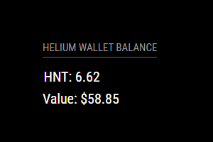

# MMM-Helium-Wallet

This is a module for the [MagicMirror²](https://github.com/MichMich/MagicMirror/).

It displays your Helium(HNT) wallet balance and the value in your chosen currency.
Uses the [helium](https://docs.helium.com/api/blockchain/introduction/) and [coingecko](https://www.coingecko.com/en/api) api's.

Also, thanks to [nhalstead for his currencies.json](https://gist.github.com/nhalstead/4c1652563dd13357ab936fc97703c019)




## Using the module

To use this module, add the following configuration block to the modules array in the `config/config.js` file:

```js
var config = {
  modules: [
    {
      module: 'MMM-Helium-Wallet',
      position: 'bottom_right'
      config: {
        // See below for configurable options
        address: 'XXXXXXXXXXXXXXXXXXXXXXXXXXXXXXXX'
        currency: 'usd'
      },
    },
  ],
};
```

## Configuration options

| Option     | Description                                                                                                                                                                                                                                                                                                                              |
| ---------- | ---------------------------------------------------------------------------------------------------------------------------------------------------------------------------------------------------------------------------------------------------------------------------------------------------------------------------------------- |
| `address`  | _Required_ Your Helium Wallet Address                                                                                                                                                                                                                                                                                                    |
| `currency` | _Required_ What currency to display. Options are: 'usd', 'ars', 'aud', 'bmd', 'brl', 'cad', 'chf', 'clp', 'cny', 'czk', 'dkk', 'eur', 'gbp', 'hkd', 'huf', 'idr', 'ils', 'inr', 'jpy', 'krw', 'lkr', 'mxn', 'myr', 'ngn', 'nok', 'nzd', 'php', 'pkr', 'pln', 'rub', 'sar', 'sek', 'sgd', 'thb', 'try', 'twd', 'uah', 'vef', 'vnd', 'zar' |
|            |
